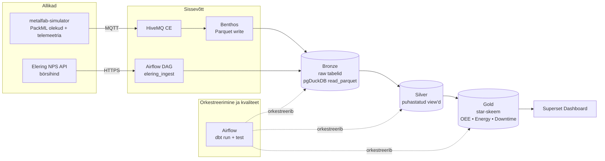

# Arhitektuur

## Äriküsimus

Kuidas masinate seisuajad ja elektrihinna kõikumised mõjutavad toodangu omahinda ja seadmete üldist efektiivsust (OEE)?

## Mõõdikud

 Peamised mõõdikud (KPI-d):
- **OEE (Overall Equipment Effectiveness):** Arvutatud reaalajas masina olekute (Running, Idle, Fault) ja tükitoodangu põhjal.
- **Tootmisühiku energiakulu (€):** Masina reaalne võimsustarbimine (kW) korrutatud börsihinnaga (€/MWh).
- **Seisuaja kulu (Downtime Cost):** Rahaline kaotus, mis tuleneb plaanivälisest seisakust.
- **Tootmise tasuvuse tagantjärele analüüs:** Arvutab tagantjärele kokku summaarse rahalise kahjumi, mis tekkis tundidel, mil elektri börsihind muutis toote omahinna kõrgemaks kui kliendile lubatud müügihind. 

## Andmeallikad

| Allikas                                       | Tüüp                        | Ajas muutuv?               | Roll                                                                                    |
| --------------------------------------------- | --------------------------- | -------------------------- | --------------------------------------------------------------------------------------- |
| `metalfab-uns-simulator` (Eindhoven, Level 4) | MQTT  | Jah, ~5s  |  masina sensorid, olekud, tükiloendurid, jne |
| Elering NPS API                               | HTTPS  | Jah, 1x ööpäevas              | börsi elektrihind €/MWh |
| `seeds/masinad.csv`                           | dbt seed (staatiline)       | Ei                         | Masinate metaandmed |
| `seeds/toote_info.csv`                        | dbt seed (staatiline)       | Ei                         | Toote metaandmed|

## Andmevoog

## Andmebaasi kihid

- `bronze` — **incremental tabelid** parquet-failidest
- `silver` — **view'd**, bronze tabelite pealt
- `gold` — **star skeem** agregeeritud andmed visuaalide ja KPI-de jaoks,

## Tööjaotus

| Roll | Vastutus | Täitja |
|------|----------|--------|
| Metalfab MQTT omanik  | Kirjutab sissevõtu loogika, hoiab andmevoo töös | Kerry Lumi |
| Elering API omanik | Kirjutab sissevõtu loogika, hoiab andmevoo töös | Erki Ohmann |
| Transformatsioonide omanik | Kirjutab mart kihi mudelid ja mõõdikute arvutuse | Erki Ohmann/Kerry Lumi |
| Kvaliteedi omanik | Kirjutab testid ja vaatab läbi ebaõnnestunud kontrollid | Kärt Kesküla |
| Näidikulaua omanik | Ehitab näidikulaua ja seob selle äriküsimusega | Kärt Kesküla |

## Riskid

| Risk | Mõju | Maandus |
|------|------|---------|
| Ei jõua kogu lahendust implementeerida | Lahendus jääb poolikuks | Tuleb mingist osast funktsionaalsusest loobuda või lahendada lihtsustatult |
| Ei saa mõnda valitud komponenti tööle | Lahendust ei tööta otsast lõpuni | Leida alternatiivne komponent või siis lihtsustada lahendust |
| Grupp laguneb | Ei jõua kogu lahendust implementeerida | Loobuda mõnest andmeallikast, lihtsustada lahendust |

## Privaatsus ja turve

Isikuandmed andmestikes puuduvad. Paroolid ning kasutajatunnused tulevad .env failist.