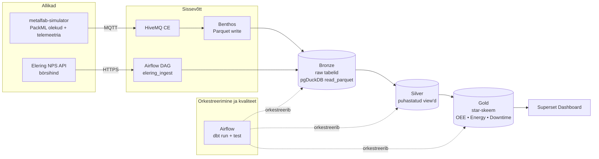

```mermaid
flowchart LR
    subgraph Allikad
        SIM[metalfab-simulator<br/>PackML olekud + telemeetria]
        EL[Elering NPS API<br/>börsihind]
    end

    subgraph Sissevõtt
        SIM -->|MQTT| HM[HiveMQ CE]
        HM --> BN[Benthos<br/>Parquet write]
        EL -->|HTTPS| ING[Airflow DAG<br/>elering_ingest]
    end

    BN --> BR[(Bronze<br/>raw tabelid<br/>pgDuckDB read_parquet)]
    ING --> BR
    BR --> SLV[(Silver<br/>puhastatud view'd)]
    SLV --> GLD[(Gold<br/>star-skeem<br/>OEE • Energy • Downtime)]
    GLD --> SUP[Superset Dashboard]

    subgraph Orkestreerimine ja kvaliteet
        AF[Airflow<br/>dbt run + test]
    end
    AF -.orkestreerib.-> BR
    AF -.orkestreerib.-> SLV
    AF -.orkestreerib.-> GLD
```
